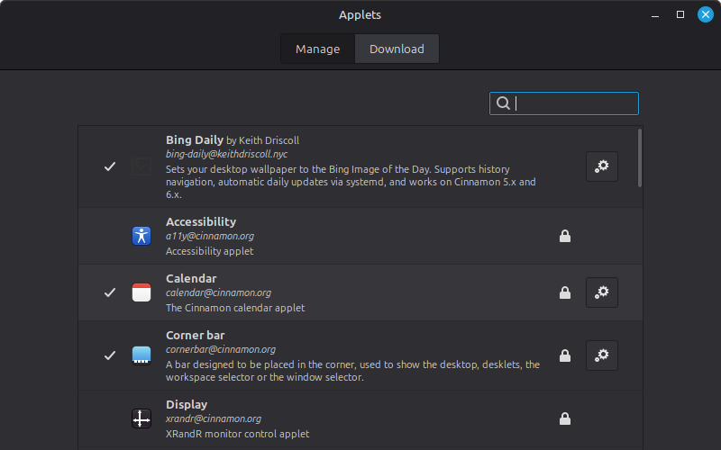
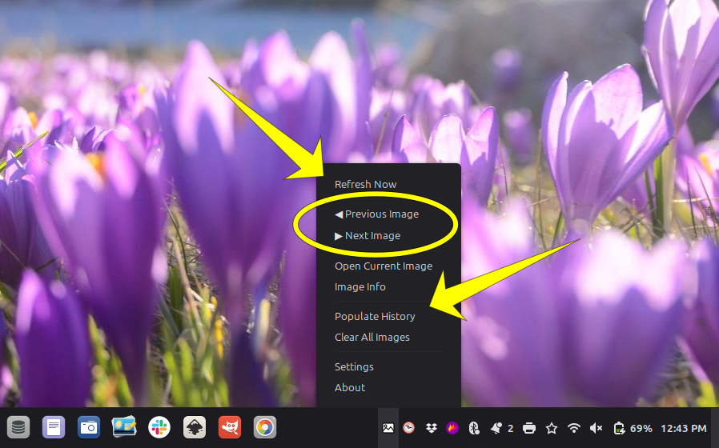
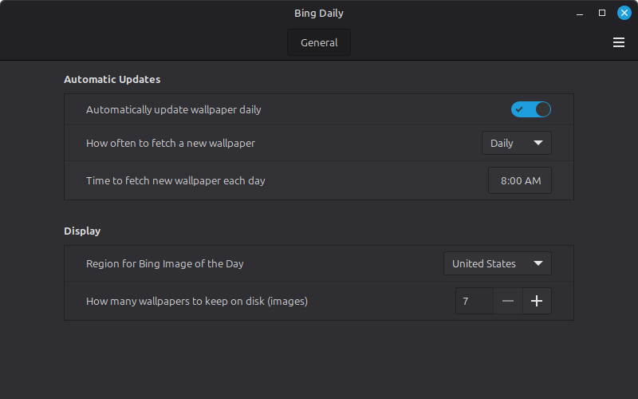
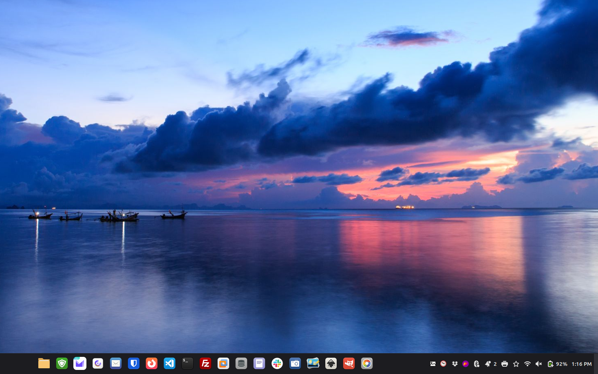

# Bing Daily

> Bing Image of the Day for your Cinnamon desktop — without pinging Microsoft.


---

## What it does

**bing-daily** is a Cinnamon panel applet that sets your desktop wallpaper to the Bing Image of the Day on a schedule you control. It keeps a local history of past images so you can browse backwards, and runs entirely in user-space with no root required.

The key difference from every other Bing wallpaper tool: **it never contacts Microsoft**. Images are fetched exclusively via [Peapix](https://peapix.com), a clean third-party API. No tracking. No telemetry. No `bing.com`.

---

## Screenshots






---

## Features

- 🖼 **Daily wallpaper** — fetches and sets the Bing Image of the Day automatically
- 🌍 **Region selection** — pick your region for locally relevant images and holidays
- 📅 **Flexible frequency** — daily, weekly, or monthly updates
- 🕐 **Custom update time** — set the exact time of day for refresh
- 🕘 **Image history** — navigate backwards and forwards through past wallpapers
- 📦 **Populate History** — bulk-download the last ~8 days in one click (great for fresh installs)
- 🗑️ **Clear All Images** — wipe the local cache from the menu
- 📶 **Network reconnect refresh** — automatically refreshes when you connect to a new network
- 🔒 **Privacy first** — zero Microsoft connections, zero telemetry
- ⚙️ **systemd timer** — reliable scheduling, no polling loops
- 🐍 **Zero dependencies** — Python 3 stdlib only, nothing to `pip install`
- 🎨 **Symbolic icon** — follows your panel theme, light or dark

---

## Compatibility

| Linux Mint | Cinnamon | Status |
|------------|----------|--------|
| 21.x | 5.4, 5.6 | ✅ Supported |
| 22.x | 6.0, 6.2, 6.4, 6.6 | ✅ Supported |

---

## Install

```bash
git clone https://github.com/keithdriscoll/bing-daily.git
cd bing-daily
bash install.sh
```

Then add the applet to your panel:

1. Right-click your Cinnamon panel → **Applets**
2. Find **Bing Daily** → click **+**
3. Click **Done**

---

## Architecture

The applet is intentionally split into two layers:

```
applet.js          — Cinnamon UI only. Menu, settings, notifications.
                     Zero network code.

engine/
  bing_engine.py   — All logic. Fetches images, manages history,
                     sets wallpaper via gsettings. Runs as subprocess.
                     Testable standalone without Cinnamon.
```

This separation means:
- **No Soup2/Soup3 compatibility issues** — works identically on Cinnamon 5.x and 6.x
- **Fully testable** — run the engine from a terminal without Cinnamon running
- **Transparent** — every action logged to `~/.cache/bing-daily/log.txt`

---

## Manual Engine Commands

```bash
ENGINE=~/.local/share/cinnamon/applets/bing-daily@keithdriscoll.nyc/engine/bing_engine.py

# Download today's wallpaper and set it
python3 $ENGINE refresh

# Show info about the current image
python3 $ENGINE info

# Navigate history
python3 $ENGINE next   # newer image
python3 $ENGINE prev   # older image

# Bulk-download the last ~8 days of images
python3 $ENGINE populate

# Clear all cached images
python3 $ENGINE clear

# Open current image in your viewer
python3 $ENGINE open
```

---

## Privacy

Built privacy-first from day one:

| What | Status |
|------|--------|
| Connects to `bing.com` | ❌ Never |
| Telemetry or analytics | ❌ Never |
| Tracking parameters logged | ❌ Stripped before logging |
| Config file permissions | ✅ `chmod 600` |
| Data stored locally | ✅ `~/.cache/bing-daily/` only |
| External pip dependencies | ❌ None |

Image source: [Peapix API](https://peapix.com/bing/feed) — a clean, privacy-respecting aggregator.

---

## Settings

| Setting | Default | Description |
|---------|---------|-------------|
| Auto-update | On | Enable/disable automatic refresh |
| Frequency | Daily | Daily, Weekly, or Monthly |
| Update time | 08:00 | Time of day for refresh |
| Region | Global | Affects local holidays and cultural imagery |
| History limit | 30 images | How many wallpapers to keep on disk |

### Region & Holidays

Bing curates daily images around local events, national holidays, and cultural moments. Selecting your region means you'll see imagery that's actually relevant — July 4th fireworks for the US, Cherry Blossom season for Japan, Diwali celebrations for India. The **Global** option uses Bing's worldwide pick with no regional bias.

---

## File Locations

| Path | Contents |
|------|----------|
| `~/.local/share/cinnamon/applets/bing-daily@keithdriscoll.nyc/` | Applet |
| `~/.cache/bing-daily/` | Images + history |
| `~/.cache/bing-daily/log.txt` | Log file |
| `~/.config/bing-daily/config.json` | Settings (chmod 600) |
| `~/.config/systemd/user/bing-daily.*` | systemd units |

---

## Uninstall

```bash
systemctl --user disable --now bing-daily.timer
rm ~/.config/systemd/user/bing-daily.{service,timer}
systemctl --user daemon-reload
rm -rf ~/.local/share/cinnamon/applets/bing-daily@keithdriscoll.nyc

# Optional: remove cached images
rm -rf ~/.cache/bing-daily
```

---

## Contributing

PRs welcome. The engine (`bing_engine.py`) is intentionally standalone — if you want to add a new image source or feature, start there.

---

## License

MIT — © 2026 Keith Driscoll · [keithdriscoll.nyc](https://keithdriscoll.nyc)
